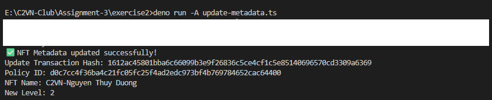

# Assignment 3

## 1. Mint 700 token Native và gửi tới Ví yêu cầu 500 token

#### Chạy files với câu lệnh

```
deno run --A mint-tokens.ts
```

#### Kết quả

Txhash của giao dịch mint : `277fd3481924fbed821b960801178d40778685a8c6d7b2f8071bfa0240e21edd`

```
✅ Token minted successfully!
Transaction Hash: 277fd3481924fbed821b960801178d40778685a8c6d7b2f8071bfa0240e21edd
Policy ID: 7d13d2026463c17a25f8196dd2a130885a91cab4b96350d066196802
Asset Name: 41737369676e6d656e7420332e312d4e677579656e20546875792044756f6e67
```


## 2. NFT CIP-68 với Metadata Mutable

Bài tập gồm 2 transaction

- (a) Mint NFT.
- (b) Update metadata.

### (a) Mint NFT

#### Chạy files với câu lệnh:

```
deno run --A mint-nft-cip-68.ts
```

#### Kết quả:

Txhash của giao dịch mint : `28589d765b28401f62ab77b6b976540999fd395322faf25189120158942a7eff`

```
✅ Token minted successfully!
Transaction Hash: 28589d765b28401f62ab77b6b976540999fd395322faf25189120158942a7eff
Policy ID: d0c7cc4f36ba4c21fc05fc25f4ad2edc973bf4b769784652cac64400
Asset Name: 4332564e2d4e677579656e20546875792044756f6e67
Full Asset ID: d0c7cc4f36ba4c21fc05fc25f4ad2edc973bf4b769784652cac644004332564e2d4e677579656e20546875792044756f6e67
```


### (b) Update metadata

Sử dụng policy id từ transaction trước để update

#### Chạy files với câu lệnh:

```
deno run --A update-metadata.ts
```

#### Kết quả:

Txhash của giao dịch update metadata : `1612ac45801bba6c66099b3e9f26836c5ce4cf1c5e85140696570cd3309a6369`

```
✅ NFT Metadata updated successfully!
Update Transaction Hash: 1612ac45801bba6c66099b3e9f26836c5ce4cf1c5e85140696570cd3309a6369
Policy ID: d0c7cc4f36ba4c21fc05fc25f4ad2edc973bf4b769784652cac64400
NFT Name: C2VN-Nguyen Thuy Duong
New Level: 2
```


